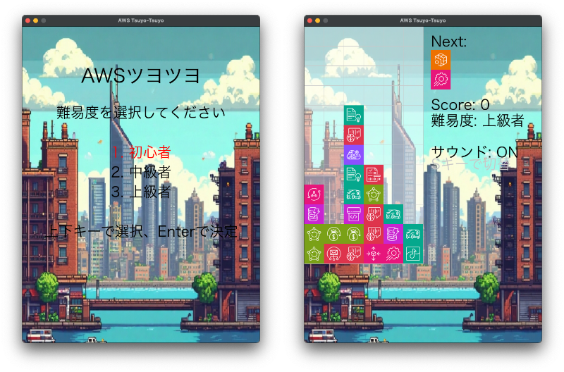

# AWSツヨツヨ (AWS Tsuyo-Tsuyo)

AWSのアーキテクチャアイコンを使用したぷよぷよ風のシンプルなゲームです。

[](https://youtube.com/shorts/uycxqQgae3w)

## 特徴

- AWSのアーキテクチャアイコンをぷよぷよの代わりに使用
- 3つの難易度レベル
  - 初心者: ランダムな4種類のアイコン
  - 中級者: ランダムな6種類のアイコン
  - 上級者: ランダムな20種類のアイコン
- 物理的な挙動: 下に空間がある場合、ぷよが分離して落下
- 連鎖アニメーション: 連鎖が段階的に消えるアニメーション効果
- BGM再生: ゲーム中にBGMが流れ、Sキーでオン/オフ切り替え可能

## インストール方法

このプロジェクトはuvを使用して依存関係を管理しています。

```bash
uv sync
```

## 遊び方

```bash
uv run main.py
```

### コントロール

- 左矢印キー: 左に移動
- 右矢印キー: 右に移動
- 下矢印キー: 下に移動（速く落とす）
- 上矢印キーまたはスペースキー: 回転
- Pキー: ゲームの一時停止/再開
- Sキー: BGMのオン/オフ切り替え
- Rキー: ゲームをリスタート
- Mキー: ゲームオーバー時に難易度選択画面に戻る
- 1キー: 初心者モード
- 2キー: 中級者モード
- 3キー: 上級者モード

## ゲームルール

1. 2つのAWSアイコンが上から落ちてきます
2. 左右に移動したり回転させたりして配置を決めます
3. 同じアイコンが4つ以上つながると消えてスコアが加算されます
4. 下に空間がある場合、ぷよは分離して落下します
5. 連鎖が発生すると、連鎖数に応じてスコアが増加します
6. アイコンが画面上部に到達するとゲームオーバーです

## 開発者向け情報

- `update_icons.py`: AWSアイコンを更新するスクリプト
- `main.py`: ゲームのメインコード
- `assets/`: アイコン、背景画像、BGMなどのアセットを格納
  
## その他

- このアプリはAmazon Q Developerを使用して作成したものです
- `download_font.py`や`download_icons.py`は記録用に残していますが残骸です
- BGMは[Udio](https://www.udio.com/)で作成しました
